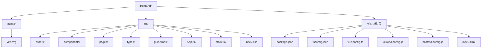
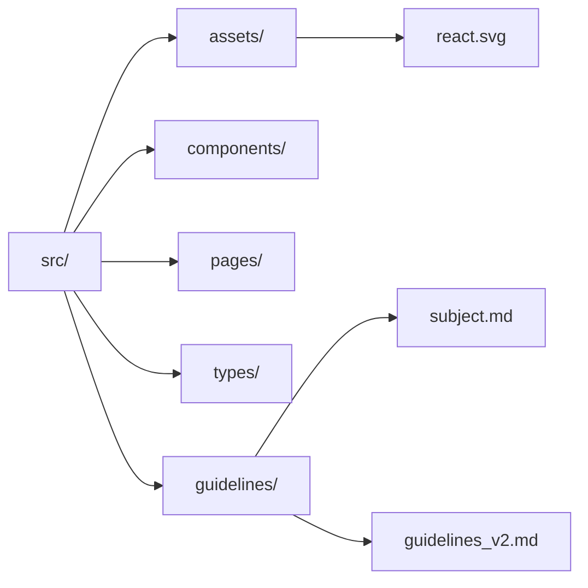
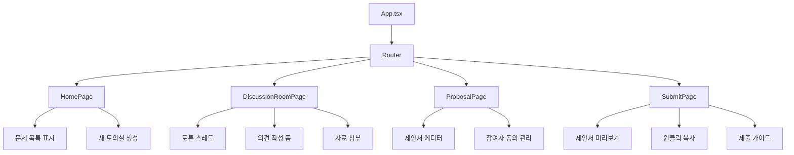
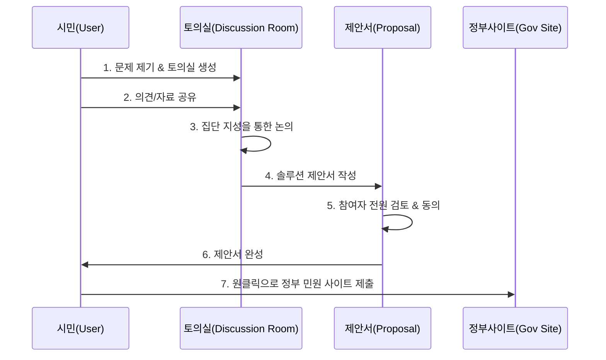
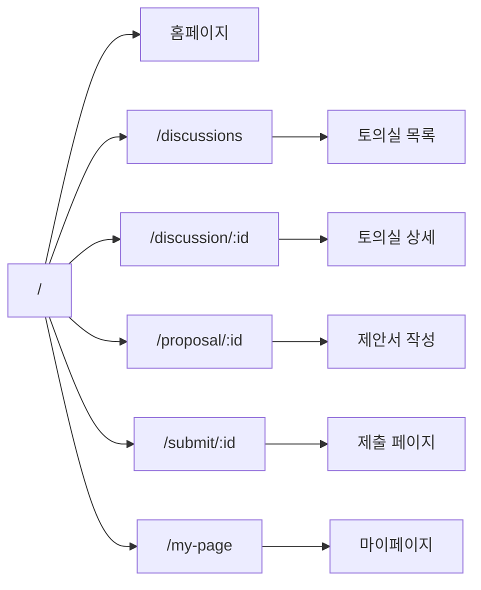

# 경기 파트너스 프로젝트 구조 및 컴포넌트 분석

## 프로젝트 개요

경기 파트너스(Gyeonggi Partners)는 지역 문제 해결을 위한 시민 참여형 플랫폼입니다. 기존의 일방향적인 민원 제기 방식에서 벗어나, 시민들이 직접 문제를 논의하고 해결책을 제시하는 협력적 거버넌스 플랫폼입니다.

### 핵심 기능
1. **솔루션 토의실**: 시민들이 지역 문제에 대해 토론하고 의견을 모으는 공간
2. **솔루션 제안서 작성**: 집단 지성을 통해 구체적인 해결책을 문서화
3. **원클릭 제출**: 완성된 제안서를 정부 민원 사이트로 간편하게 전달

## 프로젝트 기술 스택

- **React 18.3.1** - UI 라이브러리
- **TypeScript** - 타입 안전성
- **Vite** - 빌드 도구 및 개발 서버
- **React Router DOM 7.1.1** - 라우팅
- **Tailwind CSS 3.4.17** - 스타일링
- **Lucide React 0.468.0** - 아이콘

## 프로젝트 전체 구조



## 상세 파일 구조 및 설명

### 1. 설정 파일들

- package.json
  - 프로젝트 의존성 및 스크립트 정의:

- Scripts:
  - dev: Vite 개발 서버 실행
  - build: TypeScript 컴파일 후 프로덕션 빌드
  - lint: ESLint를 통한 코드 품질 검사
  - preview: 프로덕션 빌드 미리보기

- 주요 의존성:
  - React 18.3.1
  - React Router DOM 7.1.1
  - Lucide React (아이콘)
  - Tailwind CSS

- vite.config.ts
  - React 플러그인 활성화
  - 빠른 HMR(Hot Module Replacement)
  - 최적화된 번들링

- tsconfig.json
  - TypeScript 컴파일러 설정:
  - ES2020 타겟
  - Strict 모드 활성화
  - JSX 지원 (react-jsx)
  - 절대 경로 임포트 지원

- tailwind.config.js
  - Tailwind CSS 설정:
  - 컨텐츠 경로 지정 (./index.html, ./src/**/*.{js,ts,jsx,tsx})
  - 커스텀 테마 확장 가능
  - 플러그인 설정

- postcss.config.js
  - PostCSS 설정:
  - Tailwind CSS 플러그인
  - Autoprefixer (브라우저 호환성)

### 2. 엔트리 포인트

- index.html
    ```html
    <!doctype html>
    <html lang="ko">
      <head>
        <meta charset="UTF-8" />
        <link rel="icon" type="image/svg+xml" href="/vite.svg" />
        <meta name="viewport" content="width=device-width, initial-scale=1.0" />
        <title>경기 파트너스</title>
      </head>
      <body>
        <div id="root"></div>
        <script type="module" src="/src/main.tsx"></script>
      </body>
    </html>
    ```

- main.tsx
    ```tsx
    import { StrictMode } from 'react'
    import { createRoot } from 'react-dom/client'
    import './index.css'
    import App from './App.tsx'

    createRoot(document.getElementById('root')!).render(
      <StrictMode>
        <App />
      </StrictMode>,
    )
    ```

- App.tsx


### 3. 디렉토리 구조



## 예상 컴포넌트 아키텍처



## 예상 데이터 플로우



## 주요 기능별 컴포넌트 (예상)

### 1. 토의실 관련 컴포넌트

- DiscussionRoomList: 진행 중인 토의실 목록
- DiscussionRoomCard: 개별 토의실 카드
- CreateDiscussionForm: 새 토의실 생성 폼
- DiscussionThread: 토론 스레드 표시
- CommentForm: 의견 작성 폼
- FileUpload: 자료 첨부 컴포넌트

### 2. 제안서 관련 컴포넌트

- ProposalEditor: 제안서 작성/편집 에디터
- ProposalTemplate: 제안서 템플릿
- ConsentManager: 참여자 동의 관리
- ProposalPreview: 제안서 미리보기
- ProposalStatus: 제안서 진행 상태

### 3. 공통 컴포넌트

- Header: 상단 네비게이션 바
- Footer: 하단 정보
- Navigation: 메뉴 네비게이션
- Button: 재사용 가능한 버튼
- Modal: 모달 다이얼로그
- Card: 카드 레이아웃

### 4. 페이지 컴포넌트

- HomePage: 메인 대시보드
- DiscussionRoomPage: 토의실 상세 페이지
- ProposalPage: 제안서 작성 페이지
- SubmitPage: 제출 가이드 페이지
- MyPage: 내 활동 페이지

## 예상 라우팅 구조


## 빌드 및 배포

### 개발 모드

```
npm run dev
```

- Vite 개발 서버 실행
- Hot Module Replacement
- 빠른 리로딩

## 프로덕션 빌드

```
npm run build
```

- TypeScript 컴파일 체크
- 최적화된 번들 생성
- dist/ 폴더에 출력

### 미리보기

```
npm run preview
```

- 프로덕션 빌드 로컬 미리보기

### 프로젝트 특징 및 강점

1. 민주적 의사결정

- 모든 참여자의 의견이 반영됨
- 집단 지성을 통한 문제 해결
- 투명한 의사결정 과정

2. 사용자 경험 최적화

- 원클릭 제출로 간편한 프로세스
- 직관적인 UI/UX
- 반응형 디자인

3. 협력적 거버넌스

- 민(民)과 관(官)의 수평적 관계
- 시민이 솔루션 파트너로 참여
- 실질적인 문제 해결 가능

4. 효율성 향상

- 공무원 업무 부담 감소
- 현장 중심의 해결책 도출
- 빠른 문제 인식과 대응

## 보안 및 개인정보 보호 (향후 고려)
사용자 인증 시스템 필요
개인정보 암호화
HTTPS 필수
GDPR/개인정보보호법 준수
## 접근성 (Accessibility)
WCAG 2.1 가이드라인 준수
스크린 리더 지원
키보드 네비게이션
적절한 색상 대비

## 브라우저 호환성
Chrome (최신)
Firefox (최신)
Safari (최신)
Edge (최신)
모바일 브라우저 지원